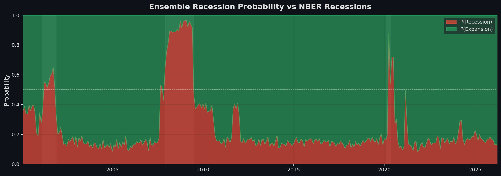
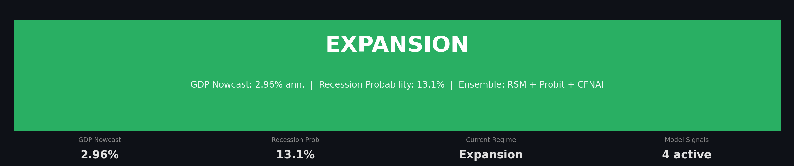
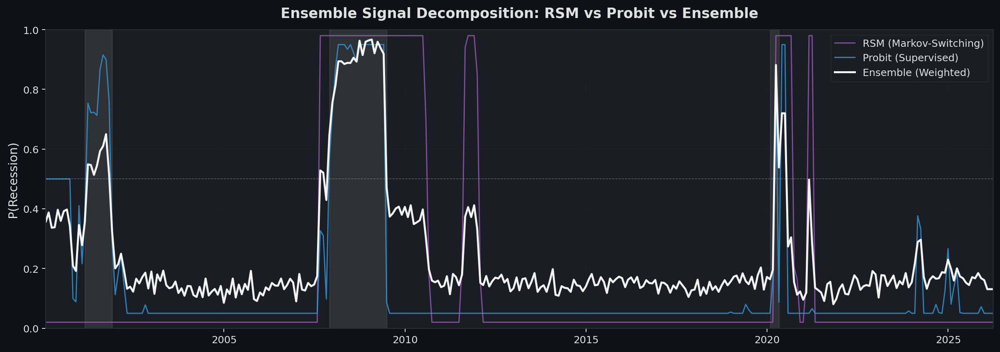
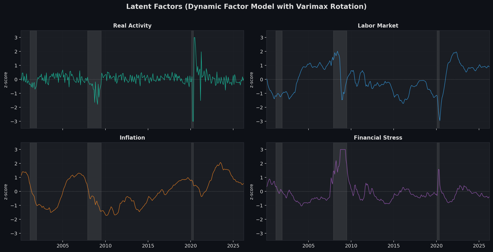
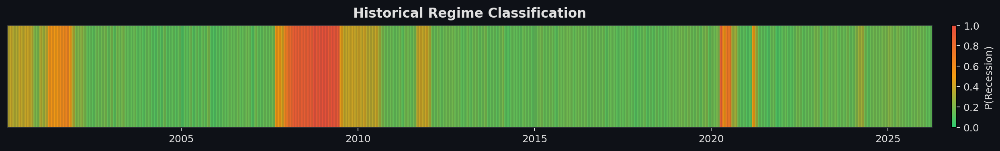
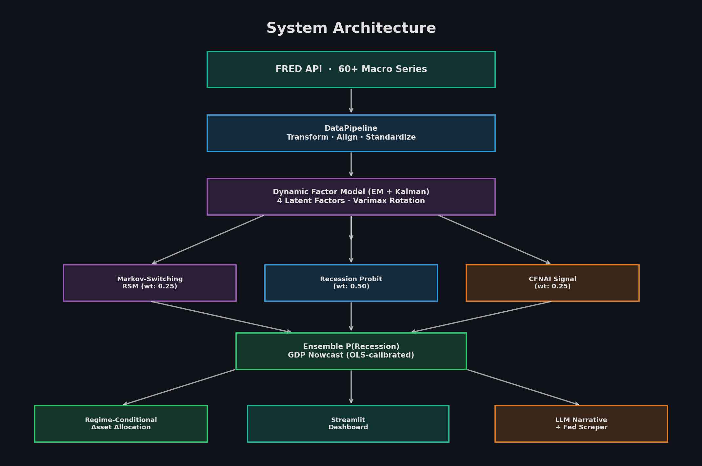

# 📊 Macro Regime Nowcaster

> Real-time economic regime detection combining Dynamic Factor Models, Kalman filtering, Markov-switching models, and ensemble recession probability — with an LLM-powered narrative agent and interactive Streamlit dashboard.

[](https://www.python.org/downloads/)
[]()
[](LICENSE)



---

## Overview

This project implements a **real-time macroeconomic regime nowcaster** that ingests 60+ economic indicators from the Federal Reserve (FRED), extracts latent factors using a state-space model, and classifies the current economic regime as **expansion** or **recession** using an ensemble of three independent signals.

### Key Features

- **Dynamic Factor Model** — EM algorithm + Kalman smoother extracts 4 interpretable latent factors from 60+ noisy macro series, with varimax rotation for factor identification
- **Ensemble Recession Detection** — Weighted combination of Markov-switching model, supervised probit (trained on NBER dates), and CFNAI threshold signal
- **OLS-Calibrated GDP Nowcast** — Factor-augmented GDP prediction regressed against actual GDPC1 quarterly growth
- **LLM Narrative Agent** — GPT-powered macro analyst that synthesizes quantitative signals with scraped Federal Reserve communications (FOMC minutes, Beige Book, speeches)
- **Interactive Streamlit Dashboard** — Full visualization suite with regime probabilities, factor dynamics, allocation weights, and one-click narrative generation
- **104 passing tests** — Comprehensive test coverage across all model components

---

## Dashboard

The Streamlit dashboard provides real-time visualization of all model outputs:



### Ensemble Signal Decomposition

Three independent recession signals are combined with learned weights:



| Signal | Weight | Method |
|--------|--------|--------|
| **Probit** | 0.50 | Supervised model trained on NBER recession dates with lagged yield curve & credit spreads |
| **RSM** | 0.25 | Hamilton (1989) Markov-switching on multivariate DFM factors |
| **CFNAI** | 0.25 | Chicago Fed National Activity Index threshold (Φ(−CFNAI)) |

### Latent Factor Dynamics

Four interpretable factors extracted via PCA + EM + varimax rotation, with sign alignment against known anchor series:



### Historical Regime Classification

Continuous regime probability mapped against NBER recession dates:



---

## Architecture



```
FRED API (60+ series)
    │
    ▼
DataPipeline ── transform, freq-align, standardize, handle ragged edge
    │
    ▼
DynamicFactorModel (EM + Kalman) ── 4 latent factors, varimax rotation
    │
    ├──► Markov-Switching RSM (wt: 0.25)
    ├──► Recession Probit    (wt: 0.50)  ◄── NBER dates, yield curve, credit spreads
    ├──► CFNAI Signal        (wt: 0.25)
    │
    ▼
Ensemble P(Recession) + OLS-calibrated GDP Nowcast
    │
    ├──► RegimeAllocator ── conditional asset weights
    ├──► Streamlit Dashboard ── interactive visualization
    └──► NarrativeAgent (GPT) + FedScraper ── macro narrative
```

---

## Quick Start

### 1. Clone and install

```bash
git clone https://github.com/AndrewFSee/macro-regime-nowcaster.git
cd macro-regime-nowcaster
pip install -e ".[dev]"
```

### 2. Set API keys

```bash
cp .env.example .env
# Edit .env and add:
#   FRED_API_KEY=your_key_here       (required — free at https://fred.stlouisfed.org/docs/api/api_key.html)
#   OPENAI_API_KEY=your_key_here     (optional — enables LLM narrative generation)
```

### 3. Run a nowcast

```bash
python scripts/run_nowcast.py
```

### 4. Launch the dashboard

```bash
streamlit run src/dashboard/app.py
```

Click **🔄 Run Nowcast** in the sidebar to fetch live data and generate results.

---

## Model Methodology

### Kalman Filter / State-Space Model

The core estimation engine is a linear Gaussian state-space model:

$$F_t = A \cdot F_{t-1} + \eta_t, \quad \eta_t \sim \mathcal{N}(0, Q)$$

$$Y_t = C \cdot F_t + \varepsilon_t, \quad \varepsilon_t \sim \mathcal{N}(0, R)$$

- $F_t \in \mathbb{R}^K$: latent factors ($K = 4$)
- $Y_t \in \mathbb{R}^N$: observed economic indicators ($N \approx 60$)
- Missing observations (ragged edge) are handled by skipping the Kalman update step

### Dynamic Factor Model (EM Algorithm)

Parameters $(A, C, Q, R)$ are estimated via the EM algorithm:
- **E-step**: Kalman smoother computes sufficient statistics $\mathbb{E}[F_t | Y], \mathbb{E}[F_t F_t' | Y]$
- **M-step**: Closed-form OLS updates for all parameters
- **Initialization**: PCA on filled data for fast convergence
- **Post-processing**: Varimax rotation for interpretable factors, sign-alignment against anchor series

### Hamilton (1989) Markov-Switching Model

Economic regimes follow a first-order Markov chain:

$$S_t | S_{t-1} \sim \text{Categorical}(P[S_{t-1}, :])$$

$$F_t | S_t = j \sim \mathcal{N}(\mu_j, \Sigma_j)$$

- Filtered probabilities via Hamilton (1989) forward recursion
- Smoothed probabilities via Kim (1994) backward smoother
- Multivariate specification uses all DFM factors jointly
- Regime labels assigned by ascending mean: index 0 = recession, index 1 = expansion

### GDP Nowcast

OLS regression of actual quarterly GDPC1 growth against DFM factors:

$$\text{GDP}_q = \alpha + \boldsymbol{\beta}' \mathbf{f}_q + \varepsilon_q$$

Calibrated in-sample, with 90% confidence intervals from the residual standard error.

---

## Project Structure

```
macro-regime-nowcaster/
├── config/
│   ├── settings.yaml              # Model hyperparameters, allocation weights
│   └── fred_series.yaml           # 60+ FRED series with transforms & lags
├── src/
│   ├── data/                      # FREDClient, DataPipeline, transforms, storage
│   ├── models/
│   │   ├── kalman_filter.py       # Kalman filter & smoother
│   │   ├── dynamic_factor_model.py # PCA + EM + varimax DFM
│   │   ├── regime_switching.py    # Hamilton Markov-switching
│   │   ├── recession_probit.py    # Supervised probit model
│   │   ├── regime_backtest.py     # NBER backtesting utilities
│   │   └── nowcaster.py           # End-to-end orchestrator
│   ├── allocation/                # RegimeAllocator, Backtester
│   ├── agent/                     # NarrativeAgent (GPT), FedScraper, prompts
│   ├── dashboard/                 # Streamlit app (8 panels)
│   └── utils/                     # Logging, date utilities
├── tests/                         # 104 pytest tests
├── notebooks/                     # 5 Jupyter notebooks (EDA → full pipeline)
├── scripts/                       # CLI: fetch, train, nowcast, backtest
├── docs/images/                   # README visualizations
├── pyproject.toml
├── requirements.txt
└── Makefile
```

---

## Data Sources

| Category | Example Series | Count |
|----------|---------------|-------|
| Labor Market | PAYEMS, UNRATE, ICSA, JTSJOL, U6RATE | ~9 |
| Production & Activity | INDPRO, TCU, CFNAI, RSXFS | ~10 |
| Financial Conditions | T10Y2Y, BAA10Y, SP500, NFCI, VIXCLS | ~11 |
| Consumer & Housing | UMCSENT, PERMIT, HOUST | ~5 |
| Prices & Inflation | CPIAUCSL, PCEPI, T5YIE, DCOILWTICO | ~8 |
| Money & Credit | M2SL, TOTBKCR, BUSLOANS | ~5 |
| GDP | GDPC1, GDPDEF, A261RX1Q020SBEA | ~3 |

All data sourced from the [FRED database](https://fred.stlouisfed.org/) (Federal Reserve Bank of St. Louis).

---

## Configuration

Key settings in `config/settings.yaml`:

| Parameter | Default | Description |
|-----------|---------|-------------|
| `model.n_factors` | 4 | Number of latent factors |
| `model.n_regimes` | 2 | Expansion / Recession |
| `ensemble.weights.probit` | 0.50 | Probit model weight (supervised) |
| `ensemble.weights.rsm` | 0.25 | Markov-switching weight |
| `ensemble.weights.cfnai` | 0.25 | CFNAI signal weight |
| `data.start_date` | 1980-01-01 | Historical sample start |
| `agent.llm_model` | gpt-4o-mini | LLM for narrative generation |

---

## Running Tests

```bash
pytest tests/ -v --cov=src
# or
make test
```

104 tests covering: Kalman filter, DFM (including varimax rotation), regime switching, recession probit, nowcaster integration, narrative agent, regime allocator, data pipeline, and utility modules.

---

## Academic References

1. Hamilton, J.D. (1989). *A New Approach to the Economic Analysis of Nonstationary Time Series and the Business Cycle*. Econometrica, 57(2), 357–384.
2. Kim, C.J. (1994). *Dynamic Linear Models with Markov-Switching*. Journal of Econometrics, 60(1-2), 1–22.
3. Doz, C., Giannone, D., & Reichlin, L. (2012). *A Quasi Maximum Likelihood Approach for Large Approximate Dynamic Factor Models*. Review of Economics and Statistics, 94(4), 1014–1024.
4. Stock, J.H., & Watson, M.W. (2002). *Forecasting Using Principal Components from a Large Number of Predictors*. JASA, 97(460), 1167–1179.
5. Bańbura, M., & Rünstler, G. (2011). *A Look into the Factor Model Black Box*. IJF, 27(2), 333–346.

---

## License

MIT License — see [LICENSE](LICENSE) for details.
